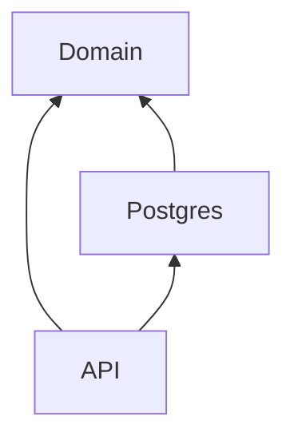

# GoLang Booking Engine API

A GoLang API project featuring a small, vertical slice of functionality for a commercial airline flight booking system, in order to demonstrate the application of concepts from Domain-Driven Design (DDD) in GoLang, along with declarative, BDD-style tests. Written to serve as my personal portfolio and demonstrate my skill-set in coding, system design, TDD, and the aforementioned areas.

## Quick-start

Requires Go, and Docker, in addition to the `make` and `curl` utilities. To start the local dependencies, run:

```
make start-local-dependencies
```

This will launch the required Postgres DB in a Docker container.

To subsequently launch the API, run:

```
make start-api
```

Curl scripts for each endpoint can be found in the `debug` folder.

## Domain terminology

| &nbsp;           | &nbsp;                                                                              |
| ---------------- | ----------------------------------------------------------------------------------- |
| Pencil Booking   | A recently-created booking which has not yet been finalized                         |
| Flight           | Refers to an individual, commercial flight                                          |
| Journey          | An itinerary of multiple, connecting flights (or "legs")                            |
| Outbound Journey | The main journey which the customer will use to reach their intended destination    |
| Inbound Journey  | An optional journey which the customer may book for returning home at a future date |

## API interface

The web API provides three main endpoints:

### POST /booking

Creates a new Pencil Booking with a specified Outbound Journey. In a user interface, this would be used for the purpose of securing the necessary flight(s) for the journey once the user has selected them, so that the seats are not lost while the Inbound Journey is selected.

Example payload *:

```
{
    "requiredNumberOfSeats": 2,
    "outboundJourneyLegs": [
        "0d7f7d89-4c2e-47b4-8c1d-6b6cb4f2c001",
        "0d7f7d89-4c2e-47b4-8c1d-6b6cb4f2c002",
        "0d7f7d89-4c2e-47b4-8c1d-6b6cb4f2c003"
    ]
}
```

Returns: The UUID of the newly-created Pencil Booking.

### PUT /booking/inbound

Patches an existing Pencil Booking with the selected Inbound Journey.

Example payload *:

```
{
    "bookingId": "271cf3fc-6382-452e-95d4-450cbc639221",
    "inboundJourneyLegs": [
        "0d7f7d89-4c2e-47b4-8c1d-6b6cb4f2c004",
        "0d7f7d89-4c2e-47b4-8c1d-6b6cb4f2c005",
        "0d7f7d89-4c2e-47b4-8c1d-6b6cb4f2c006"
    ]
}
```

(*) Valid flight IDs must be used for the inbound and outbound journey legs. A number of flights are seeded in the Postgres DB, which can be seen in the migration script [postgres/migration/0000000008_seed_flights.up.sql](https://github.com/jakem324/go-flight-booking-engine/blob/master/postgres/migration/0000000008_seed_flights.up.sql)

### GET /booking/:id

Returns a summary for the specified Pencil Booking.

Example request:

```
GET /booking/3a021c8c-6200-40ac-928f-621e53d5d58f
```

Example response:

```
{
  "bookingId": "3a021c8c-6200-40ac-928f-621e53d5d58f",
  "numberOfPassengers": 2,
  "outboundJourneyLegs": [
    {
      "departureDate": "2099-01-02T06:15:00Z",
      "departureAirportCode": "MEL",
      "departureTerminal": "T4",
      "arrivalDate": "2099-01-02T07:40:00Z",
      "arrivalAirportCode": "SYD",
      "arrivalTerminal": "T2"
    },
    {
      "departureDate": "2099-01-02T08:50:00Z",
      "departureAirportCode": "SYD",
      "departureTerminal": "T1",
      "arrivalDate": "2099-01-02T16:40:00Z",
      "arrivalAirportCode": "SIN",
      "arrivalTerminal": "T3"
    }
  ],
  "inboundJourneyLegs": [
    {
      "departureDate": "2099-01-02T09:20:00Z",
      "departureAirportCode": "SYD",
      "departureTerminal": "T1",
      "arrivalDate": "2099-01-02T19:45:00Z",
      "arrivalAirportCode": "CDG",
      "arrivalTerminal": "T2E"
    },
    {
      "departureDate": "2099-01-02T09:40:00Z",
      "departureAirportCode": "MEL",
      "departureTerminal": "T2",
      "arrivalDate": "2099-01-02T11:05:00Z",
      "arrivalAirportCode": "BNE",
      "arrivalTerminal": "T1"
    }
  ]
}
```

## Architecture

This project uses a Hexagonal architecture in which the core business rules are implemented by a centralized Domain library, on which all other supporting libraries (database layers, Web API projects, external services) depend. This dependency direction is achieved via Inversion of Control, so that the library containing the pure business logic remains completely unaware of the technical infrastructure which supports it.

In this case, the supporting projects include a single Web API and a single access layer for a Postgres DB:



## Module structure

### Object types

**Entities** represent the real-world objects applicable to the domain being implemented — bookings and flights in this case. They implement the logic corresponding to every action which can be taken for or by the given object within the business context.

**Commands** and **queries** represent the user access model. Commands define the actions that may be taken for or on behalf of any user (often involving one or more entities), and queries define the data that may be retrieved for said users.

In this arrangement, my approach — based on the advice in the writings of Vaughn Vernon — differs from many typical DDD implementations, in which entities are used as data models while the command handlers implement the core business logic. This is a common anti-pattern known as domain model anemia, which my approach has been designed to avoid. As such, the entity acts as a write-only model; it does not interact with the repository layer until its functionality is called upon. The query handlers therefore bypass the entities entirely, returning their own read-model instead.

### Folders

The entire solution is maintained as a single Go module, but is separated into three distinct folders: **domain**, **api**, and **postgres**. Packages within the latter two folders depend on packages within the `domain` folder, while those within the `domain` folder are self-contained.

#### Domain

This dependency direction is maintained by placing the contracts — the models and interfaces representing the repository layer — in `domain/contracts`, which the supporting `postgres` packages implement. Adjacent to this, entities, commands, and queries can be found in their own respective folders.

#### Postgres

Contains a Postgres implementation of the contracts in `domain`. Any type of implementation can be used and added adjacent to the `postgres` implementation; it is the `api` package that decides which one to use. This implementation connects to the Postgres DB in Docker, initializing the database with the script in the `migration` folder.

Adjacent to this is `repositories` and `queryhandlers`, containing the implementations for the repositories and query handlers defined respectively in `domain/contracts` and `domain/queries`.

#### API

Implements a Web API using the functionality from `domain` in conjunction with the infrastructure in `postgres`. This API package is responsible for bundling the `postgres` implementation together with the `domain` to create a functioning runtime. Any alternate service layer — a gRPC server, a server-side web app, a desktop app, etc — can be implemented in the same way using this type of initialization.

## Testing

For the purpose of this project, end-to-end tests have been omitted, and the `api` and `postgres` layers are intended as simple adapters to enable debugging and demonstration; this is not intended to represent a production-ready system in its current state.

The BDD-style tests (found in `domain/commands/pencil_test.go`) cover the public interface of the domain — the command handlers — without testing the internals (the entities). This enables the entities to be refactored and replaced flexibly while the command handler tests ensure that the domain's workflow remains stable. Since the `query` section of the domain only defines a contract which the repository layer implements, query testing has been omitted as well.
